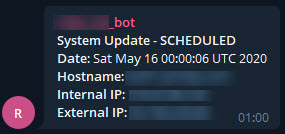
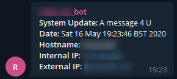

# Important - Dependencies required

The script doesn't rely on too much, however you must have the following installed for it to operate:

* curl
* lsb_release (out of box for Ubuntu, but needs `redhat-lsb-core` for CentOS/RHEL)
* dig (install `dnsutils` on DEB systems and `bind-utils` on RPM systems)

---

# How to use this script and supporting files

The way I operate this script is to clone the repo into a folder somewhere, such as in `/root/`, so my folder structure will look like

`/root/pi-ip-logging/...`

I do this only because the CRONTAB I've created has directive to run the script `@REBOOT`, this can only be done if the script is run as root. Another reason to run as root is it will attempt to install any dependencies using `apt-get`, at this time the only real dependency is `dnsutils`, most other commands called are stock and found in typical installs.

## Self Updating Script

If you want to use the self-updating function of the script (it's disabled out of the box), then you need to run the script from the cloned repo folder so the GIT data is intact. 

## Setting up

I install using the process similar to

```
cd /root
git clone https://github.com/M1XZG/pi-ip-logging.git
chmod +x /root/pi-ip-logging/PI-host/log-my-ip.sh
cp /root/pi-ip-logging/PI-host/log-my-ip.CRONTAB /etc/cron.d/log-my-ip
chmod 644 /etc/cron.d/log-my-ip
chown root.root /etc/cron.d/log-my-ip
```

At this point you should double check `/etc/cron.d/log-my-ip` to make sure the paths to the script are correct, if you've left the repo cloned in `/root/` then it will be.

### log-my-ip.ini

This file isn't required if you want to just customize the varibles in the script, however, that will prevent you from using the self-updating part as your changes will be lost to the script. The INI file just contains all the variables required by the script, the default location for this is `/usr/local/etc/log-my-ip.ini`, again, changing this could break. _(I have a future plan to allow the updating of the INI file from perhaps your private webserver or something, GitHub would be bad for this as it will contain secrets you don't want anyone to get)_

### log-my-ip.sh

This script is run on the Debian linux machines, like the [Raspberry Pi](https://www.raspberrypi.org/) and it will send the hostname, internal IP, external IP and the date/time of the Pi.

To use telegram you will need to create a telegram bot (or use an existing one) and you'll also need the chat / group / channel ID for the bot to receive messages and display them.  There are many guides to figure out how to get the chat id's and such, but check out:
https://www.home-assistant.io/components/telegram/

The `log-my-ip.sh` script requires no arguements, but whatever you supply will be used as the note that's sent to your or logged. If you look in `/etc/cron.d/log-my-ip` you'll see on reboot the script is called with *REBOOT* and nightly at midnight when I run my daily checkpoint it uses *SCHEDULED*, you can of course change these. If you want to use more than ONE word, just wrap the words in double quotes.



This is a run of the script where changes to the repo were found, these are pulled down and the script is run again with the updated version. The `log-my-ip.sh` ins't updated in this run, but other files where, so these are brought down. To have ONLY the script update it would need to be in it's own repo or even a branch of it's own.

```
## Using Discord instead of Telegram

If you prefer Discord notifications, use `log-my-ip-discord.sh` which posts to a Discord channel via an Incoming web hook.

Setup steps:

1) Create a Discord Incoming web hook for your target channel and copy its URL.
2) Edit or create `/usr/local/etc/log-my-ip.ini` and set:

   - `DISCORD_WEBHOOK_URL="https://discord.com/api/webhooks/…"`
   - Optionally `DISCORD_USERNAME` and `DISCORD_AVATAR_URL`.

3) Make the script executable and install the CRON file:

   - `chmod +x /root/pi-ip-logging/PI-host/log-my-ip-discord.sh`
   - `cp /root/pi-ip-logging/PI-host/log-my-ip-discord.CRONTAB /etc/cron.d/log-my-ip-discord`
   - `chmod 644 /etc/cron.d/log-my-ip-discord`
   - `chown root.root /etc/cron.d/log-my-ip-discord`

4) Adjust paths in `/etc/cron.d/log-my-ip-discord` if your clone location differs from `/root/pi-ip-logging`.

The Discord message contains: System Update note, Date, Hostname, Internal IP, and External IP.

root@tinkerbell:~/pi-ip-logging/PI-host# ./log-my-ip.sh "A message 4 U"
remote: Enumerating objects: 21, done.
remote: Counting objects: 100% (21/21), done.
remote: Compressing objects: 100% (13/13), done.
remote: Total 17 (delta 3), reused 13 (delta 3), pack-reused 0
Unpacking objects: 100% (17/17), done.
From https://github.com/M1XZG/pi-ip-logging
   cc966e6..d1a4bff  master     -> origin/master
Found a new version of me, updating myself...
Updating cc966e6..d1a4bff
Fast-forward
 CODE_OF_CONDUCT.md        |  76 ++++++++++++++++++++++++++++++++++++++++++++++++++++++++++++++++++++++++++++
 PI-host/README.md         |  25 ++++++++++++++++++++++++-
 README.md                 |  25 +++----------------------
 media/telegram-sample.jpg | Bin 0 -> 17243 bytes
 media/telegram-sample.png | Bin 0 -> 10542 bytes
 5 files changed, 103 insertions(+), 23 deletions(-)
 create mode 100644 CODE_OF_CONDUCT.md
 create mode 100644 media/telegram-sample.jpg
 create mode 100644 media/telegram-sample.png
Already on 'master'
Your branch is up-to-date with 'origin/master'.
Already up-to-date.
Running the new version...
[ TELEGRAM OUTPUT REMOVED ]
```

The telegram message recieved from the above run was




---
